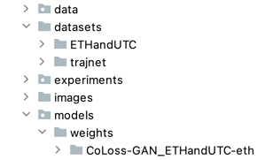

# SIM2Goal

This repository contains the code for the papers:

**<a href="https://www.techrxiv.org/articles/preprint/Proactive_Robot_Movements_in_a_Crowd_by_Predicting_and_Considering_the_Social_Influence/19739467/1">Proactive  Robot  Movements  in  a  Crowd  by  Predicting  and  Consideringthe  Social  Influence</a>**
  <br>
  Martin Moder,
  Josef Pauli
  <br>
  Accepted at International Conference on Advanced Robotics (ICAR) 2021

The code for this paper can be found at: `Sim2Goal/`

**<a href="https://ieeexplore.ieee.org/document/9659409">CoLoss-GAN: Collision-Free Human Trajectory Generation with a Collision Loss and GAN</a>**
  <br>
  Martin Moder,
  Josef Pauli
  <br>
  Accepted at International Conference on Advanced Robotics (ICAR) 2021

The code for this paper can be found at: `Sim2Goal/experiments/`

Keywords: human path prediction,human path planning, human trajectory prediction, human path forecasting, pedestrian location forecasting, location prediction, position forecasting, future path forecasting, next second location, multi-agent forecasting

If you find this code useful in your research then please cite our preprint which is in submission to Ro-Man 2022
```
@article{Moder2022,
author = "Martin Moder and Josef Pauli",
title = "{Proactive Robot Movements in a Crowd by Predicting and Considering the Social Influence}",
year = "2022",
month = "5",
url = "https://www.techrxiv.org/articles/preprint/Proactive_Robot_Movements_in_a_Crowd_by_Predicting_and_Considering_the_Social_Influence/19739467",
doi = "10.36227/techrxiv.19739467.v1"
}

```
or 
```
@INPROCEEDINGS{moder2021CoLoss,
  author={Moder, Martin and Pauli, Josef},
  booktitle={2021 20th International Conference on Advanced Robotics (ICAR)}, 
  title={CoLoss-GAN: Collision-Free Human Trajectory Generation with a Collision Loss and GAN}, 
  year={2021},
  pages={625-632},
  doi={10.1109/ICAR53236.2021.9659409}}
```
## Installation
First make sure that the dependencies in requirements.txt are installed. 

Please download and extract the trained <a href="https://drive.google.com/file/d/1aac0cFlYGbtY2ULxXd7jOJM9UgYDuBS7/view?usp=sharing">weights</a> into Sim2Goal/models/weights .
Please download and extract the <a href="https://drive.google.com/file/d/16TcBqhN-G6n3ZNBic2NxX0xVsYeqCtLa/view?usp=sharing">datasets</a> into Sim2Goal/datasets .

The rep should look like this: 


Note: The ETHandUCY dataset is directly taken from <a href="https://github.com/agrimgupta92/sgan/blob/master/README.md">SGAN</a>. 
For <a href="https://github.com/vita-epfl/trajnetplusplusdata/releases/tag/v4.0">TrajNet++</a> _real_ dataset we selected the following scenes:
```
biwi_hotel.ndjson
crowds_students001.ndjson
crowds_students003.ndjson
crowds_zara01.ndjson
crowds_zara03.ndjson
lcas.ndjson
wildtrack.ndjson
```
For the social influence experiment we used the Trajnet++ _synth_ data. To precosess them we used the script `split_trajnet_synth.py`

## Running pretrained Models

First, for each model that is to be executed, the correct configuration must be in `config.py`.
For example, if you want to run the Sim2Goal model, the content of `SIM2Goal_config.py` must be copy pasted 
into `config.py` for the respective data set.

Then you can use the scripts:
1) `eval_GoalFlow.py` to run any of the pretrained GoaFlow models on ETHandUCY or Trajnet++ datsets
2) `eval_GoalFlow_divSampling.py` to run any of the pretrained GoaFlow models and diversity sampling on ETHandUCY or Trajnet++ datsets
3) `eval_Sim2Goal.py` to run any of the pretrained Sim2Goal models on ETHandUCY or Trajnet++ datsets
4) `eval_SI.py` to run the pretrained Social Influence experiment on the synth environment of Trajnet++
5) `evaluate_GAN.py` to run any of the pretrained GAN models on ETHandUCY or Trajnet++ datsets
6) `evaluate_VAE.py` to run any of the pretrained VAE model on ETHandUCY or Trajnet++ datsets

## Learning New Models
As with the evaluation, it must first be ensured that the correct config has been stored.
To train the SIm2Goal network from scratch, the GoalFlow must first be trained. The GoalFlow is trained in 2 phases: 1) The GoalFlow is trained with the script `train_GoalFlow.py`. 2) To sample as diverse as possible from the pre-trained GoalFlow, the sampler is trained with `train_GoalFlow_divSampling.py`.  Only then can the Sim2Goal be trained with `train_Sim2Goal.py` and then the Social Influence experiment with `train_SI.py`. To train on the whole training dataset just use the script `train_dataset.py` (just import the learning script here).
The same applies to the models in the experiment path.

We will now give you an overview of the most important parameters:
### Optimization

- `batch_size`: How many sequences to use in each minibatch during training. Default is 64.
- `num_epochs`: Number of training epochs. Default is 300
- `g_learning_rate:` learning rate for the generative model

### Dataset options

- `trajnet`: If True use Trajnet++ else ETHandUCY.
- `dataset_name`: The scene name to use for training. Default is `synth`. Note in `train_dataset.py` this will be set automatically. 
- `obs_len`: Number of time-steps in input trajectories. Default is 8.
- `pred_len`: Number of time-steps in output trajectories. Default is 8.
- `loader_num_workers`: The number of background threads to use for data loading. Default is 4.
- `skip`: Number of frames to skip while making the dataset. For e.g. if Sequence<sub>1</sub> in the dataset is from Frame<sub>1</sub> - Frame<sub>N</sub> and skip = 2. Then Sequence<sub>2</sub> will be from Frame<sub>3</sub> - Frame<sub>N+2</sub>. Default is 1.

### Model options and others
- `num_samples`: How many samples during evaluation.
- `DIR`: Path to the weights.
- `GFlow_checkpoint_start_from`: Path to pretrained GoalFLow.
- `sampler_checkpoint_start_from`: Path to the sampler model.
- `experiment_name`: Sets the name for the experiment.
- `check_after_num_epochs`: Checkpoints are saved to disk every `--checkpoint_every` iterations. Default is 100. Each checkpoint contains a history of training losses, error metrics like ADE, FDE etc,  the current state of the generator, discriminators, and optimizers, as well as all other state information needed to resume training in case it is interrupted. We actually save two checkpoints: one with all information, and one without model parameters; the latter is much smaller, and is convenient for exploring the results of a large hyperparameter sweep without actually loading model parameters.

## Thanks to

https://github.com/agrimgupta92/sgan/blob/master/README.md on which this rep. is build on.

https://github.com/ikostrikov/pytorch-flows for Normalizing Flow implementation.

https://github.com/Khrylx/AgentFormer for augmentation script